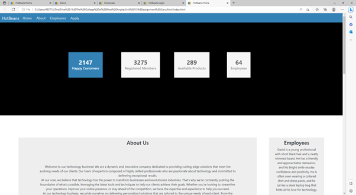

# Unit 15 Assignment Two

[TOC]

## Requirements

The requirements that are needed to be implemented in the website are:

* A profile of the company itself

* profiles of existing trainee web developers

* job specifications and required qualifications

* an on-line application form

* links to web development courses

The target audience for the site is people who have completed training courses or qualifications related to web development and are now looking for a job as a web developer.

### Tooling

The tools i will use in this project will include photoshop, illustrator, font awesome and bootstrap.

## plan

### Homepage

In my homepage design i am including an introduction to the company and its porfolio of clients and employers. Clear navigation menu to access different sections of the website. Prominent call-to-action (CTA) buttons for job seekers and course information.

#### About Us

Detailed profile of the company, including its history, values, and achievements. Overview of the company's expertise in web development. Testimonials or case studies showcasing successful projects.

#### Meet Our Team

Profiles of existing trainee web developers. Include their names, photos, backgrounds, skills, and experiences. Highlight their professional growth within the company.

#### Job Opportunities

Provide detailed job specifications and descriptions for available positions. Include information about the company's expectations, responsibilities, and benefits. Clearly outline required qualifications, such as educational background and technical skills.

#### Online Application Form

Create a user-friendly application form for interested candidates. Include fields for personal information, education, work experience, and relevant skills. Allow applicants to upload their resume or portfolio.

#### Web Development Courses

Provide links to recommended web development courses or resources. Include descriptions and reviews for each course. Categorize courses based on skill levels (beginner, intermediate, advanced).

#### Blog/News Section

Publish articles related to web development, industry trends, and company updates. Share informative content to engage users and establish the company's expertise. Include social sharing buttons to facilitate content distribution.

#### Contact Us

Provide contact information, including email, phone number, and physical address. Include a contact form for general inquiries or feedback. Offer a map or directions to the company's location.

#### Footer

I will include navigation links for easy access to important sections of the website, Display relevant legal information, such as privacy policy and terms of use. Add social media icons and links to the company's profiles for easy follow-up.

#### Responsive Design

I will ensure the website is mobile-friendly and accessible on various devices, and optimize the website's layout, images, and content for different screen sizes. Test the website across different browsers to ensure compatibility. SEO and Analytics:

## Design

### Wireframes/Storyboards

### Colour Schemes

The colour schemes i had originally came up with was a dark blue and orange. with the hex colours of #feb900 and #002c47 but this has recently been changed.

I have used the 60, 30, 10 rule in this website to make my website appear more professional and more simplistic. When going for this type of colour layout the users reading your website will be able to read the information without getting too distracted by the colours popping out of the page.

This is a colour pallette of the colours i chose using the 60, 30, 10 rule.

I then modified the colour scheme to a more simplistic colour pallete which was a lighter blue and white. with the hex colours of #3482b5, #eee and #ffff.

### Typography

The fonts i have used are the segoe ui font and the bootstrap font for headdings. I chose the segoe ui font in my website because it had a nice design and made the website much more professional and made the writing cleaner to make it more readable on the page. I have aimed to keep the font usage to a maximum of 2 fonts for the website because more than 2 fonts will cause the webpage to become cluttered and unprofessional.

### Navigation

I have came up with two designs for a navbar, one with a logo and one without. They both acheive similar goals in getting to the right information but it is more of a difference of design choice between the two. i prefer the light blue one because it appears more simplistic on the page and less cluttered on the screen with its thin and dynamic design.

### Alternative design

This was my first design implementation where i tried to implement the first iteration of colours and layout. I came to the conclusion that i did not like the flexbox layout or the orange acents, so i decided to change it to what it eventually came out to be in the final product. I also thought the logo was a little over the top so i will change it to more of a simplistic logo that lookes more professional.

### Design justification

In my final design choice, i have decided to implement the flexboxes in this way because it will make the website focus on the more important like the about us flexbox which is larger becuase i want the users to read that first to draw them in and then the employees flexbox as a little bit of a sub paragrapgh about the employees. Also, the information boxes that will go at the top of the page will make the webpage more professional looking and give some eye catching information about the company and will encorage the reader to scroll further. I will implement the job details towards the bottom of the page because that sort of information is not normally found at the top of a webpage. I will include a hyperink to the job form in that paragrapgh for efficient and convinent navigation purposes. The footer i want to be useful and full of navigational use becuause i want the user to navigate the website efficiently and to make the contents easy to find. The colours in the website will make the website look more professional with more neutral colours being used and the fonts being used will make the website look aesthetically pleasing and easy for the user to read the contents.

### Test Plan

#### introduction

I will provide an overview of the website being tested. State the objectives and goals of the testing process. Define the scope of testing, including supported browsers and devices.

#### Test Strategy

Testing approach will be regression testing, useability testing and software performance testing. I will test different environments, including supported operating systems and browsers.

#### Test Scope

Identify the different modules, features, and functionalities of the website. Define the priority of each module based on its criticality to the website's success. Determine which features should be thoroughly tested and which can be tested at a higher level.

#### Test Scenarios

I will develop a list of test scenarios that cover all the functionalities of the website. I will include both positive and negative test cases for each scenario. Consider edge cases, boundary values, and typical user workflows.

#### Test Data

Define the necessary test data for executing the test scenarios. Include both valid and invalid data to cover various scenarios. Determine the testing techniques to be used (e.g., functional, usability, performance). Identify any specific tools or frameworks that will be utilized during testing. Consider exploratory testing to uncover any unforeseen issues.

#### Test Sign-Off

I will identify the stakeholders who need to review and approve the test results. Specify the process for obtaining sign-off on the testing phase. Define any criteria for retesting or regression testing before final sign-off.

## implementation

Firstly i implemented the navbar with the correct font and hexadecimal colour. With a headder that i was unsure on what to put inside but i came up with an advertisement for the company with reviews, members of the website(people that signed up) and number of employees in the business. I think this feature of the website works well with the overall theme of the website and fits the design vey well.
I have added a employees column contents and also implemented the companies logo into the about us section.
I have created a log in or sign up page which can be accessed through the footer or the apply section in the navbar and i decorated this form page with the corrisponding colour scheme to the home page to keep the concistency.

This is what my homepage looks like so far.

My next task was to add a job specification section below the about us section to showcase the job on offer. i Decided to use a flexbox to put the information inside which is going to cover accross the width of the page.

This is the final outcome of the job specification section and i think the paragraphs are nicely spaced out, however i may change the position of the text toward the center to be consistant with the about us section.

### Change Log

I have changed the colour scheme from a gold and black to a blue, white and orange highlight.
I have changes the layout from a two column layout to a triple column layout.
I have changed the colums to a double column flexbox layout with a flexbox at the bottom which covers the width of the page.
I have changed the colour scheme to a more lighter blue and made the navbar look more simplistic.
I have added a employees column contents and also implemented the companies logo into the about us section.
I have created a log in or sign up page which can be accessed through the footer or the sign up section in the navbar.
I have created a hamburger for smaller screen devices which works well.
I have added an about us page about the company and job description.
I have added a employees page giving a more in depth view about the employees.

### Justification of Design Changes

In my website, i have altered my design many time including the aesthetic, layout and overall useability. The first thing i altered in my design was the navbar. i thought the first one was too big and got in the way of other components like the flexboxes whixh i also changed alot. The navbar was also very cluttered with many links which i dint want and a big logo in it which i didnt like for aesthetic and uaseability uses because it got in the way, so i changes it to a nicer blue and just the brand name and with only 4 nav links to make it easier to navigate though the website. The flexboxes was the next design choice to change. I didnt like the original triple column layout i was originally going for because i thought it was too much to look at on one page so, alternatively i opted for a double column layout with the right side flex being slightly smaller than the right because i was aiming for the right flexbox to become more of a sub section of the website and the right side being more of the section to make the reader scroll on. I Then added a flexbox at the bottom of those two which covers the whole webpage and that has things about the job which wasnt in the original plan but i went for it because i felt like i needed to include a section about the job and the companys logo.

I changed the logo recently from the gold logo (top logo) to the current logo (Bottom logo)
 

## Test

Firstly i am going to test that the website can run on more than one browser (Cross Browser Compatibility).

I have tested the website on edge and it appears that the website works efficiently and runs normally with little loading time.

I have now tested the website on firefox and the website has no issues with loading up the website and navigating through pages seems to be no problem.

The response time for both edge and firefox was very fastand i was able to access all pages, interactive links and buttons with very little delay time. Now im going to test the website on one final search engine which is chrome and see how it responds to the website.

The functionality of the website was tested next and i started with the navbar. I was able to access all pages through the navbar on the homescreen, apply page, about us page and employees page so no broken links were identified.
The footer has 9 links and all work properly and efficiently allowing the user to access pages at the bottom of the website. The next feature i tested was the media feature. I tested this on chrome, firefox and edge.

The test was successful and also shows me that the the hamburger in the top right of the screen works correctly too which is what i would like to test next.

This feature is working as it should be and you can have access to all pages when selecting the hamburger, it also works on all the other pages just as well.

### Rectification Errors

### Outstanding Errors

### User Feedback

One of my peers has given me feedback on my website and has said what went well and what i can do to improve:

Design:

The overall design of the website is clean and visually appealing. The combination of white, gray, and blue colors creates a professional look.
The logo at the top-left corner helps in branding and adds a nice touch to the design.
The layout is well-organized, making it easy to navigate and find information.
Homepage:

The hero image/banner on the homepage is eye-catching and sets a positive tone for the website.
It would be helpful to have a clear and concise headline or tagline that immediately communicates the purpose or value proposition of the website.
Consider adding some introductory text or a brief paragraph to provide an overview of your website's purpose, products, or services.
Navigation:

The navigation menu is simple and intuitive, allowing users to easily access different sections of the website.
It might be beneficial to add some visual indication or highlight on the active page in the navigation menu to improve user experience and provide better orientation.
Content:

The "About" page provides a good amount of information about your company and its background. Consider adding more details about your team, values, or any unique selling points to further engage visitors.
The "Services" page provides a clear overview of the services you offer. However, it would be beneficial to include more detailed descriptions of each service, including any specific features, benefits, or examples.
The "Contact" page contains essential information and a contact form, which is great. Consider adding additional contact details like a phone number or social media links if applicable.
Responsive Design:

The website appears to be responsive and adjusts well to different screen sizes, which is essential for a good user experience across devices.
Overall, your website has a professional and visually appealing design. To enhance it further, consider refining the content, adding more details about your services, and improving the user experience by making small tweaks to the navigation and providing clear calls to action.

## Reveiw

In my website i think that the things i have done well was the layout as i felt it would make the website stand out with the different flexbox layouts and the different type of contents. I think my colour choice was sensible and modern with basic colours but makes the site simplistic. I think what i should do better is to do what my peers recommend i do and tweak the navbar slightly to match the contents and also spend some time focusing on some of the sizing for different screens as some div classes doesnt corrispond with the screen size eg.the employees box on the homepage doesnt respond with sizing very well. My plan for this website turned out to become a different concept which i find a good thing because it shows that i have been having lots of ideas for my website and i felt like my design mock ups and wireframes were foundations and turned it into what it is now.

### Response to Feedback

### Evaluation

### References
